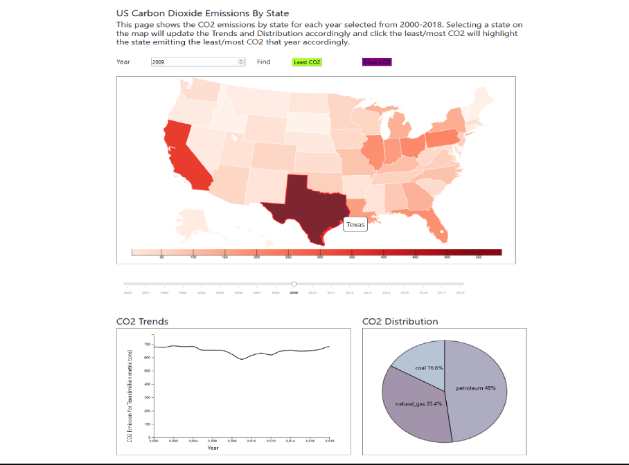
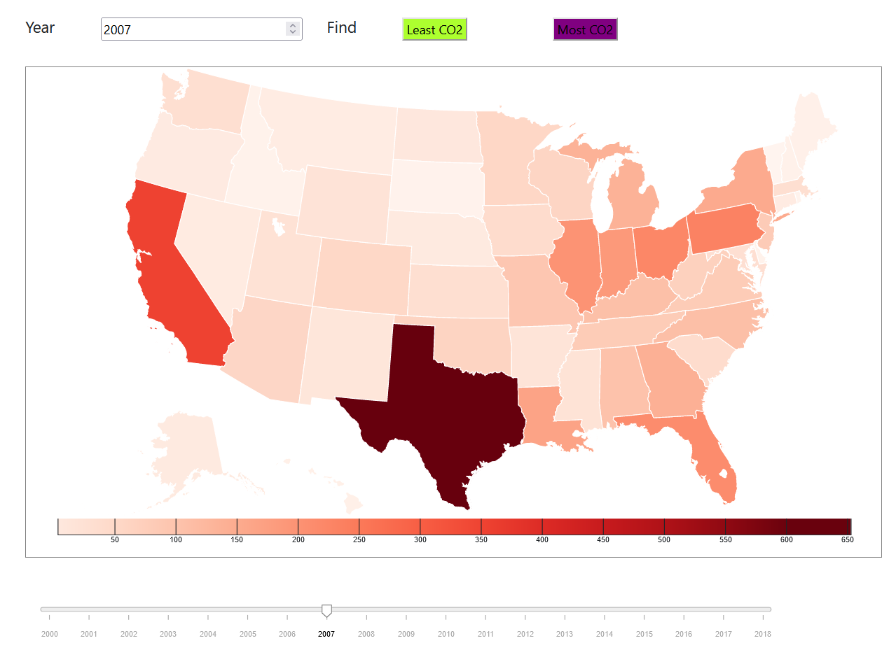

# Final Writeup

US Carbon Dioxide Emissions By State

Chan Maung, Christopher Campanella, Michael Fields

## Overview:

Our project showcases the CO2 emissions for each state from 2000-2018 as well as the percentage of materials that make up those emissions from each state. The core of the website consists of 3 visualizations, which are a map, a line chart, and a pie chart. All the visualizations are linked together by the map, which shows the state name when hovering over a state. When the user selects a state on the map, the line graph and pie chart update accordingly to show the appropriate data for that state.

The map itself shows the amount of CO2 emitted by color with a dynamically updating color scale legend based on the year selected. The line graph shows the change in overall CO2 emissions for the selected state, and the pie graph shows the type of materials that caused those emissions (Coal, petroleum, and natural gas) in a percentage value. The website also contains a slider in the form of a timeline that allows the user to change the current year displayed on the map, thus updating the color ratio of the map.

## Data description
The target users for our data consist of anybody with interest in the topic, except for maybe some more expert-level users. This data isn’t super detailed or specific for those who may be an expert in the field looking for something along those lines. Our data is more about providing awareness to those who aren’t familiar with the subject, therefore it shows easy to read information and how the data relates to itself. The data we show stays on the informative and simplistic side of things so that the user looking at it can easier understand what it is they are looking at.

For preprocessing the amount of CO2 emission part of the data, we rearranged some of the data so that the years are the first column of the data with the rest of the columns going through each state with their respective data values per year based on the first column. For preprocessing the fuel used, we only took the percentage of each fuel contributing to the overall CO2 emissions and then formatted it similar to the first part, but instead had the type of fuel used on the first column instead of the year.

Link to [Dataset](https://www.eia.gov/environment/emissions/state/)

## Goals and Tasks
Assuming the user doesn’t know already, the most likely reason a user would be looking at this data is to see the amount of CO2 emitted by each state and how each state compares to one another. The user might also be looking at it if they want to know the main types of materials that are causing the CO2 emissions.
One task the users may wish to perform that we have implemented would be to click on and select a state, and for the information regarding that state to update in real-time. This can also apply to the visualizations updating in real-time when changing the year on the website as well.

## Idioms
The interface that we have built shows CO2 emissions for each state by displaying a color coded map that is linked to a line graph as well as a pie chart. These visualizations are all shown on the same screen with the map visualization being about twice the size of the other two on the top part of the screen, while the other two visualizations are below the map.
Reference images to each of the three visualizations will be posted below:
Image of First/Main Visualization (Map)

Image of Second Visualization (Line)

Image of Third Visualization (Pie)

The main three implemented visualizations are the map chart, line graph, and pie chart, as mentioned earlier. The map chart is the main point of control for the website. It allows the user to select a state on the map, which on selection will update the displayed information based on the state selected. Changing the map chart also allows the user to see the line graph and pie chart update in real-time based on the state selected. The line graph shows the level of CO2 emissions from the selected state from the years 2000-2018. The pie chart shows which fuels were used in these emissions in a percentage value. Changing the year with either the timeline or the manual input will also update the map chart in real-time, thus showing the ratio of CO2 emissions between each state based on the color.

For the map chart we wanted that to be our main source of interaction from the user, so when the user clicks something on the big interactable map, then the rest of the visualizations would update accordingly. We made the map visualization about twice the size of the other visualizations because it is the most important one. We also show the level of CO2 emissions for the year selected in the map chart by updating the color accordingly, as well as updating the legend scale below the map. For the line graph we wanted a way to show the user the change in CO2 emissions from each state over time, but the map can’t really do that alone. Because of this we decided to make the line graph to show it in a separate visualization so that the user has a better time understanding the information. For the pie chart, the other two visualizations already made can’t easily show the percentage of which type of fuel was used for the CO2 emissions. Because of this we decided to make a pie chart, which is great for showing percentage values, to show the ratio of fuels used by each state.

We didn't really have any alogrithms in our code, as our project was pretty straight forward and had no real complications except for maybe connecting all the visualizations together.

## Reflection
At first our project was just to create three visualizations that showed the data on CO2 emissions from each state over the years as well as the type of fuels used. This idea didn’t really have the idea to link the graphs together in real-time so that when the user clicks a state on the map, the other two visualizations would update as well. This proposal was very realistic in that we knew we could get those features implemented pretty easily. We actually decided to This goal did change from this more basic view into what our final project is now.

It wasn’t until the WIP that we decided to implement the feature of linking the visualizations together into our project. After the WIP, though, there wasn’t anything as major as linking the visualizations that we added. We added a timeline in the form of a slider for the user to be able to change the year of the data shown, as explained earlier. We also added two buttons that highlight the states that gave off the most and least CO2 accordingly for the currently selected year. Besides some minor polish and making sure there were no bugs in the code, that was all we added from the WIP.

Overall there weren’t any unexpected challenges that arose that inhibited us as a whole group to complete our planned features. The only kind of feature that we didn’t get around to implementing was making an innovative view for our project. We had some ideas towards the end of the project of what we could do for an innovative view, but we decided that what we had was good enough for a project and to focus our time on other classes. If there were a next time, we would probably try to come up with an innovative view earlier in the process so that we have plenty of time to implement it.

## Team workload
Chan set up the project at the start with an outline of what the website would contain. Chan also then created the map chart and all its functionalities as well as linked together the visualizations. Chan also was the one who found the data we ended up using and was the one who had the core ideas for the project as a whole.

Christopher setup and created the line graph visualizaiton and also wrote out the WIP report as well as this final writeup report, as well as some very minor tweaks with the website.

Michael setup and created the pie chart for the website and also had good ideas and input for the project as a whole and was mainly the one to organize meetings for the group.
